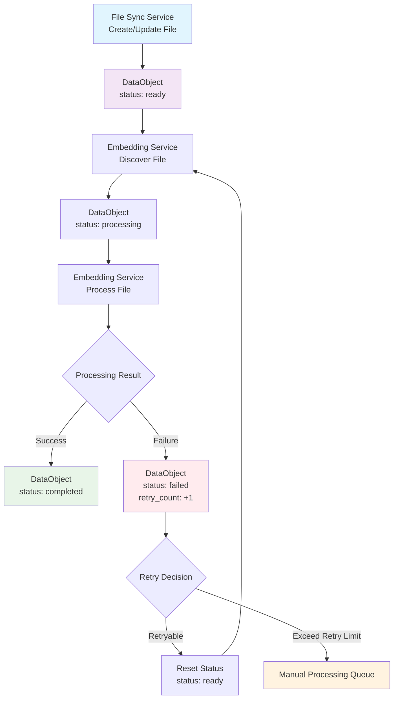
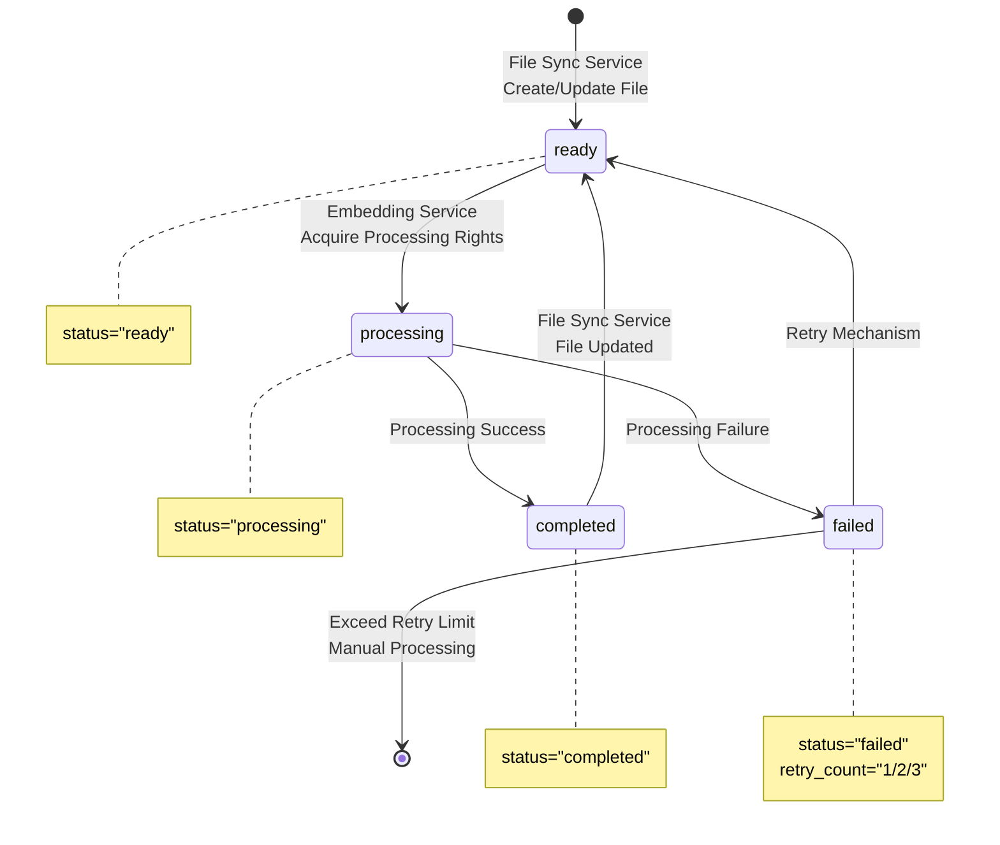

# S3 File Tags State Change Process Documentation

## Overview
This document describes the state change process of S3 file object Tags across various service nodes.

## Core Nodes
- **File Sync Service**: File synchronization service responsible for syncing data from data sources to S3
- **DataObject**: Data file objects on S3, managed through Tags for state control
- **Embedding Service**: Downstream vectorization processing service

## S3 Tags Definition

### Core Status Tags
```
- status: "ready" | "processing" | "completed" | "failed"
- retry_count: "0" | "1" | "2" (optional, added during failure retry)
```

## Tags State Change Process

### Scenario 1: File Sync Service Creates New File
```
DataObject Tags Setting:
└── status: "ready"
```

### Scenario 2: File Sync Service Updates File
```
DataObject Tags Update:
└── status: "ready"     # Reset to ready for processing
```

### Scenario 3: Embedding Service Processes File
```
Before processing: status="ready" → status="processing"
After processing: status="processing" → status="completed"
```

### Scenario 4: Processing Failure Retry
```
On failure: status="processing" → status="failed" + retry_count="1"
On retry: status="failed" → status="ready"
```

## Complete Flow Diagram

The complete state transitions and processing logic are shown in the flow diagram below, including normal processing paths and exception retry mechanisms.

### Overall Processing Flow Diagram


### State Transition Diagram


## Concurrency Control
- Embedding Service acquires tasks through Tags state preemption
- Only instances that successfully update status from "ready" to "processing" gain processing rights
- Regularly clean up timeout processing status files

---

*Document Version: v2.0* 