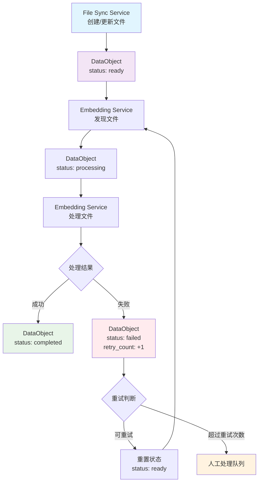
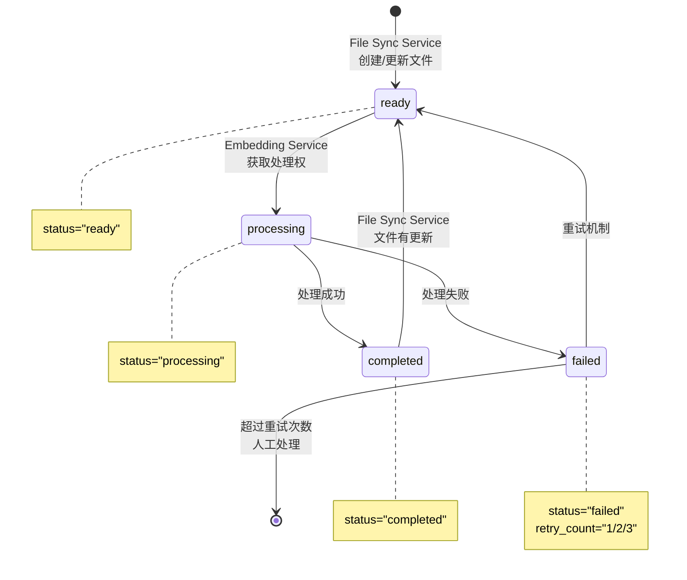

# S3文件Tags状态变动流程文档

## 概述
本文档描述了S3文件对象的Tags标签在各个服务节点间的状态变动流程。

## 核心节点
- **File Sync Service**: 文件同步服务，负责从数据源同步数据到S3
- **DataObject**: S3上的数据文件对象，通过Tags管理状态
- **Embedding Service**: 下游向量化处理服务

## S3 Tags定义

### 核心状态标签
```
- status: "ready" | "processing" | "completed" | "failed"
- retry_count: "0" | "1" | "2" (可选，失败重试时添加)
```

## Tags状态变动流程

### 场景1：File Sync Service 创建新文件
```
DataObject Tags设置:
└── status: "ready"
```

### 场景2：File Sync Service 更新文件
```
DataObject Tags更新:
└── status: "ready"     # 重置为ready等待处理
```

### 场景3：Embedding Service 处理文件
```
处理前: status="ready" → status="processing"
处理后: status="processing" → status="completed"
```

### 场景4：处理失败重试
```
失败时: status="processing" → status="failed" + retry_count="1"
重试时: status="failed" → status="ready"
```

## 完整流程图

上述流程的完整状态转换和处理逻辑如流程图所示，包含正常处理路径和异常重试机制。

### 整体处理流程图


### 状态转换图


## 并发控制
- Embedding Service通过Tags状态抢占任务
- 只有成功将status从"ready"更新为"processing"的实例获得处理权
- 定期清理超时的processing状态文件

---

*文档版本: v2.0* 